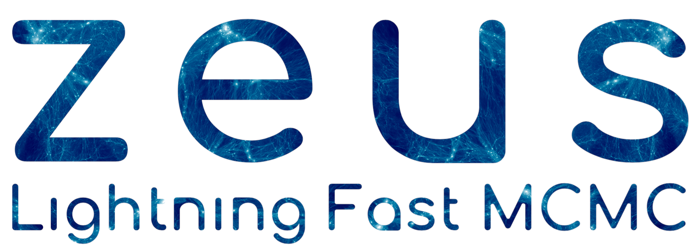

**zeus is a Python implementation of the Ensemble Slice Sampling method.**

- Fast & Robust *Bayesian Inference*,
- Efficient *Markov Chain Monte Carlo (MCMC)*,
- Black-box inference, no hand-tuning,
- Excellent performance in terms of autocorrelation time and convergence rate,
- Scale to multiple CPUs without any extra effort,
- Automated Convergence diagnostics.

[](https://github.com/minaskar/zeus)
[](https://arxiv.org/abs/2002.06212)
[](https://arxiv.org/abs/2105.03468)
[](https://ascl.net/2008.010)
[](https://travis-ci.com/minaskar/zeus)
[](https://github.com/minaskar/zeus/blob/master/LICENSE)
[](https://zeus-mcmc.readthedocs.io/en/latest/?badge=latest)
[](https://pepy.tech/project/zeus-mcmc)


## Example

For instance, if you wanted to draw samples from a 10-dimensional Gaussian, you would do something like:

```python
import zeus
import numpy as np

def log_prob(x, ivar):
    return - 0.5 * np.sum(ivar * x**2.0)

nsteps, nwalkers, ndim = 1000, 100, 10
ivar = 1.0 / np.random.rand(ndim)
start = np.random.randn(nwalkers,ndim)

sampler = zeus.EnsembleSampler(nwalkers, ndim, log_prob, args=[ivar])
sampler.run_mcmc(start, nsteps)
chain = sampler.get_chain(flat=True)
```

## Documentation

Read the docs at [zeus-mcmc.readthedocs.io](https://zeus-mcmc.readthedocs.io)


## Installation

To install ``zeus`` using ``pip`` run:

```bash
pip install zeus-mcmc
```

To install ``zeus`` in a [[Ana]Conda](https://conda.io/projects/conda/en/latest/index.html) environment use:

```bash
conda install -c conda-forge zeus-mcmc
```

## Attribution

Please cite the following papers if you found this code useful in your research:

```bash
@article{karamanis2021zeus,
  title={zeus: A Python implementation of Ensemble Slice Sampling for efficient Bayesian parameter inference},
  author={Karamanis, Minas and Beutler, Florian and Peacock, John A},
  journal={arXiv preprint arXiv:2105.03468},
  year={2021}
}

@article{karamanis2020ensemble,
    title = {Ensemble slice sampling: Parallel, black-box and gradient-free inference for correlated & multimodal distributions},
    author = {Karamanis, Minas and Beutler, Florian},
    journal = {arXiv preprint arXiv: 2002.06212},
    year = {2020}
}
```

## Licence

Copyright 2019-2021 Minas Karamanis and contributors.

zeus is free software made available under the GPL-3.0 License. For details see the `LICENSE` file.
